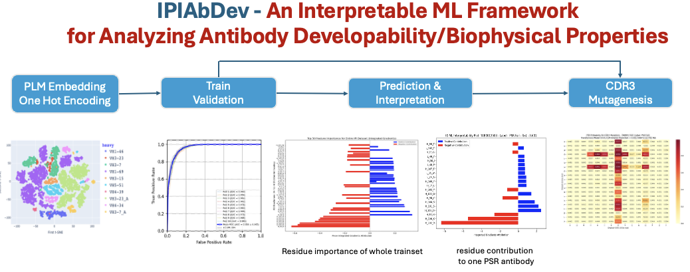
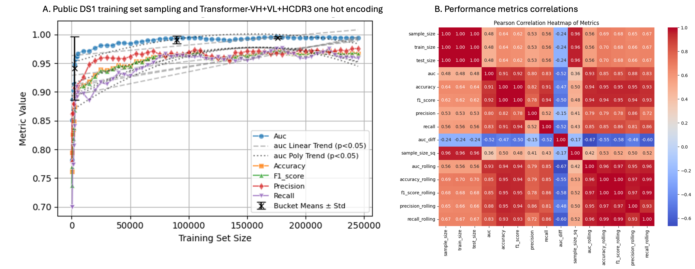
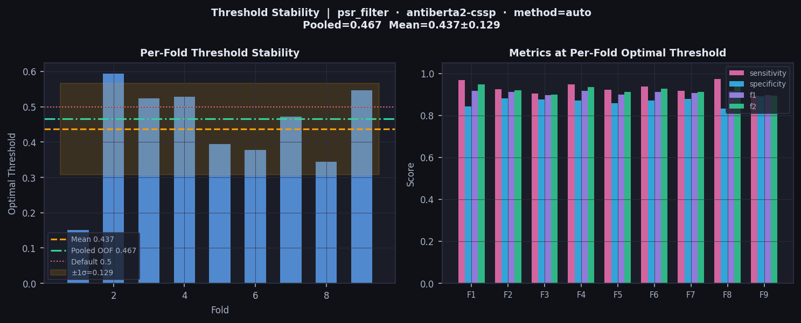
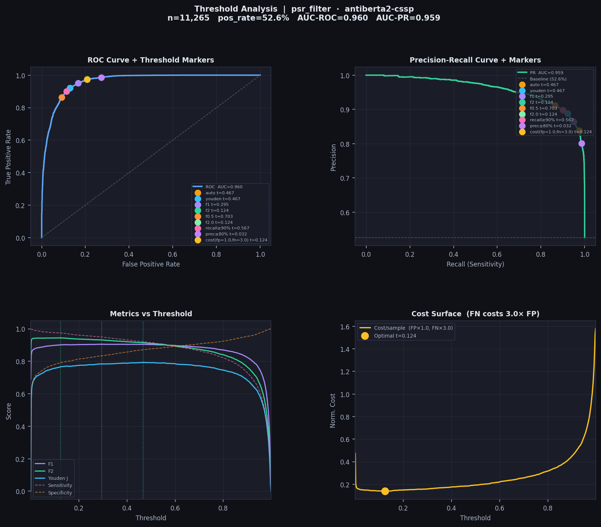

IPIAbDev is a highly flexible AI-ML Framework, designed for high-throughput prediction of antibody developability and biophysical properties, with a primary focus on polyreactivity (PSR) and SEC developability, while being extensible to SPR binder, HIC, etc. It integrates multiple antibody-specific protein language models (AbLang2, AntiBERTy, AntiBERTa2, AntiBERTa2-CSSP) for embedding generation and supports a diverse set of classifiers, including XGBoost, Random Forest, 1D-CNN with residual blocks, and Transformer architectures. Key features include automated embedding generation, HCDR3-cluster-stratified k-fold cross-validation to prevent data leakage, model training and prediction for binary classification tasks, and built-in interpretability via Integrated Gradients for residue-level attribution. The package also provides publication-ready visualization of ROC curves, performance metrics (AUC, accuracy, F1, precision, recall), and attribution heatmaps

This open source software was developed at The Antibody Platform, Institut for Protein Innovation,Boston, USA

Machine Learning Architect and Designer: [Hoan Nguyen, PhD](https://www.linkedin.com/in/hoan-nguyen-82549420/)

Authors and Contact: {Hoan.Nguyen, [Andre.Teixeira](https://www.linkedin.com/in/andr%C3%A9-a-r-teixeira-6155857/) }@proteininnovation.org

# Sequence-based ML models and Encoding
Full heavy and light chain sequences,  Heavy chain sequences, CDR3 sequences

Protein Lanuage model embedding, one hot encoding, sequence biophysical properties (molecular weight, charge, Isoelectric Point,..)

# Trainset size vs Model performance and Generalization diagnostics

The ML data in figure (A,B) below was generated by IPIAbDev with Transformer-VH+VL+HCDR3 one hot encoding and public dataset #1 from  (HT Chen, 2024) 

# Identifying optimal threshold for binary classification

# From Prediction to Residue Interpretablity to Antobody Mutagenesis

# Download and install: IPIAbDev package 

git clone https://github.com/proteininnovation/IPIAbdev.git
  
#Create a new environment with Python 3.11 or 3.12
conda create -n ml python=3.11 -y
conda activate ml

#python package install
conda install -c bioconda anarci
pip install -r requirements.txt

# How to use IPIAbDev
# prepare train set

   filename:         your_trainset_name.xlsx 
   required columns: BARCODE,CDR3,HSEQ,LSEQ, any_biophysical_properties_column as sec_filter,psr_filter ,spr_filter
   any_biophysical_properties_column : this label should be annotated as 1 (pass/positive) or 0 (fail or negative)
  
# Generate embeddings
python predict_developability.py --build-embedding data/test.xlsx --lm all

python predict_developability.py --build-embedding data/test.xlsx --lm ablang

# Xgboost trainning evaluation with k-fold validation
python predict_developability.py --kfold 10 --target sec_filter --lm antiberta2 --model xgboost --db data/ipi_antibody.xlsx

# Randomforest training evaluation with k-fold validation
python predict_developability.py --kfold 10 --target sec_filter --lm antiberty --model rf --db data/ipi_antibody.xlsx

# CNN trainning evaluation with k-fold validation
python predict_developability.py --kfold 10 --target sec_filter --lm antiberta2 --model cnn --db data/ipi_antibody.xlsx

# Transformer trainning evaluation with k-fold validation
python predict_developability.py --kfold 10 --target sec_filter --lm antiberty --model transformer_lm --db data/ipi_antibody.xlsx

# Transformer with one hot encoding trainning evaluation with k-fold validation
python predict_developability.py --kfold 10 --target sec_filter --lm onehot --model transformer_onehot --db data/ipi_antibody.xlsx

# Train final  model with full dataset
#SEC trainning

python predict_developability.py --train --target sec_filter --lm antiberta2 --model xgboost --db data/ipi_antibody.xlsx

#PSR trainning

python predict_developability.py --train --target sec_filter --lm antiberta2 --model xgboost --db data/ipi_antibody.xlsx

#  Predict instantly
python predict_developability.py --predict data/new_lib.xlsx --target sec_filter --lm antiberta2

# Predict on test set
python predict_developability.py --predict data/test.xlsx --target sec_filter --lm ablang --model cnn

